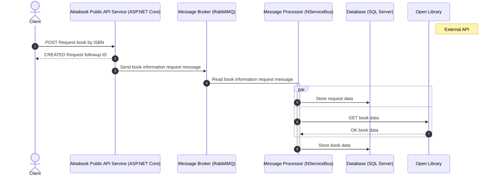

# Aktabook

An experimental work-in-progress book data aggregator API,
showcasing ASP.NET Core.

## Happy flow

The following sequence diagram shows the basic happy flow of Aktabook.

## Showcases

The following is a partial list of standards, practices, software,
and ideas leveraged by this project:

- .NET 8.0
- .NET OpenAPI analyzers
- .NET static analyzers
- .NET Tools
- ASP.NET Core
- Azure Pipelines
- C# 12
- C# Script
- Clean Architecture
- Code test coverage with dotnet-coverage
- CodeQL
- Conventional Commits
- DevSkim
- dotnet security-scan
- EditorConfig
- EF Core
- FluentAssertions
- FluentValidation
- GitHub Actions
- Integration testing
- Locked mode NuGet
- Markdown
- Markdownlint
- MediatR
- Mermaid
- Migrations testing
- Modern code style
- NServiceBus
- NSubstitute
- Open Library API
- OpenAPI/Swaggar
- OpenTelemetry
- RabbitMQ
- ReSharper command line tools
- Service health checks
- SonarScanner
- SQL Server
- Strongly-typed approach
- Structured logging with Serilog
- Testing with a production-grade database engine
- Unit testing with xUnit.net
- xUnit.net Analyzers

## License

This software is released under an [MIT-style license](LICENSE).
Copyright © 2024 Omar Boukli-Hacene.

SPDX license identifier: MIT.

---

Made for the joy of it 🐳
