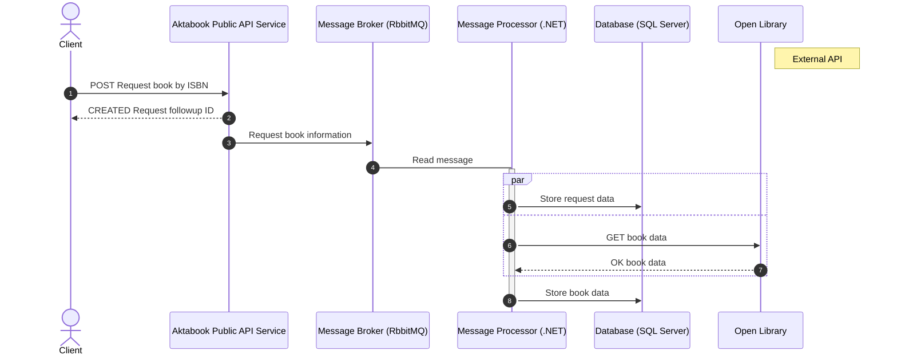

# Aktabook

An experimental work-in-progress book data aggregator API.

## Happy flow

The following sequence diagram shows the (work-in-progress)
basic happy flow of Aktabook.

## Show cases

- C# 10
- C# Script
- .NET 6.0
- .NET Tools
- ASP.NET Core
- EF Core
- NServiceBus
- SQL Server client
- RabbitMQ client
- GitHub Actions
- Strongly-typed approach
- Testing with a production-grade database engine
- Unit testing
- Integration testing
- MediatR
- FluentValidation
- FluentAssertions
- Code test coverage
- SonarScanner
- Service health checks
- Locked mode NuGet
- Clean Architecture
- Modern code style
- OpenTelemetry
- Serilog
- Open Library API
- Conventional Commits
- DevSkim
- OpenApi/Swaggar
- Markdown
- OpenAPI analyzers

## License

This software is released under an [MIT-style license](LICENSE).
Copyright © 2022 Omar Boukli-Hacene.

SPDX license identifier: MIT.

---

Made for the joy of it 🐳
